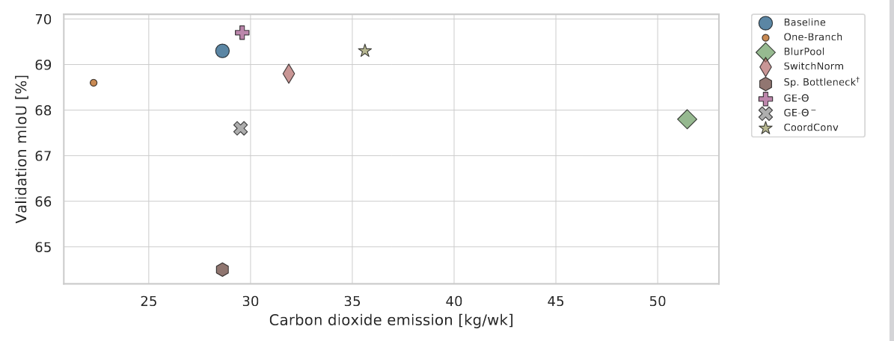

# GreenerAI

This is the official repository of AIxIA 2021 paper "[Highlighting the Importance of Reducing Research Bias and Carbon Emissions in CNNs](https://link.springer.com/chapter/10.1007/978-3-031-08421-8_36)" by [Ahmed Badar](https://www.linkedin.com/in/ahmedbadar512/), [Arnav Varma](https://scholar.google.com/citations?user=3QSih2AAAAAJ&hl=en&oi=ao), [Adrian Staniec](https://www.linkedin.com/in/adrianstaniec/), [ Mahmoud Gamal](https://mrgemy95.github.io/), [Omar Magdy](https://www.linkedin.com/in/omar-magdy-2018/?originalSubdomain=nl), [Haris Iqbal](https://www.linkedin.com/in/hiqbal88/?originalSubdomain=nl), [Elahe Arani](https://www.linkedin.com/in/elahe-arani-630870b2/), [Bahram Zonooz](https://scholar.google.com/citations?hl=en&user=FZmIlY8AAAAJ). 

We benchmark methods for improving deep learning applications fairly, and note that these methods do not necessarily result in generalizable improvements across datasets and applications when benchmarked uniformly. Furthermore, accuracy and emmissions / energy consumption aren't correlated, such that some methods consume more energy even without improving accuracy.

###  Figure : validation mIoU (for Cityscapes) and emmissions are not correlated.

Moreover, we demonstrate that training for half the number of epochs, or even training with a significantly smaller version of the base network (one out of the two branches of BiSeNet) achieves comparable accuracy at lower energy costs (as much as even half in the former case), making for __Greener AI__.

## Instructions

Instructions and 'environment.yml' files for running Classification and Segmentation experiments are available in the respective folders.

## Cite Our Work

If you find the code useful in your research, please consider citing our paper:

<pre>
@inproceedings{badar2022highlighting,
  title={Highlighting the importance of reducing research bias and carbon emissions in cnns},
  author={Badar, Ahmed and Varma, Arnav and Staniec, Adrian and Gamal, Mahmoud and Magdy, Omar and Iqbal, Haris and Arani, Elahe and Zonooz, Bahram},
  booktitle={AIxIA 2021--Advances in Artificial Intelligence: 20th International Conference of the Italian Association for Artificial Intelligence, Virtual Event, December 1--3, 2021, Revised Selected Papers},
  pages={515--531},
  year={2022},
  organization={Springer}
}
</pre>

## License

This project is licensed under the terms of the MIT license.

